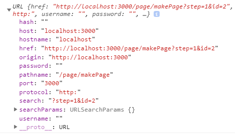
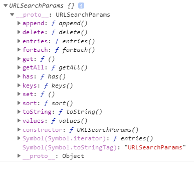

## URLSearchParams를 이용한 param 값 제어

### * 해당 페이지 주소 URL 생성
```
let url = new URL(location.href);
console.log(url);
```

- URL 생성자를 이용한 해당 주소 url 관련 값 출력  
  


### * search를 이용하여 param 값 query string으로 가져오기
```
let query_string = url.search;
console.log(query_string);
// ?step=1&id=2
```
  
  
### * URLSearchParams 이용하여 param 값 제어
```
let search_params = new URLSearchParams(query_string); 
console.log(search_params);
```
  
### * URLSearchParams 메서드
  
  

### * append() : URL param 값 추가(중복 추가)
```
//기존 : step=1&id=2 
search_params.append('step', 2);
//step=1&id=2&step=2
```
  
### * set() : URL param 값 넣기(중복 제거)
```
//기존 : step=1&id=2 
search_params.set('step', 2);
//step=2&id=2
```
  
### * has() : URL param 값 체크
```
//기존 : step=1&id=2 
search_params.has('step');
//true
```

### * get() : URL param 값 가져오기(여러 개면 앞에 하나만 가져온다!)
```
//기존 : step=1&id=2&step=2
search_params.get("step");
//1
```

### * getAll() : URL 해당 param 값 모두 가져오기
```
//기존 : step=1&id=2&step=2
search_params.get("step");
//["1", "2"]
```

### * toString() : URL param 값 쿼리스트링으로 가져오기
```
search_params.toString();
//step=1&id=2&step=2
```

### * delete() : URL param 값 제거
```
//기존 : step=1&id=2
search_params.delete('id');
//step=1
```
