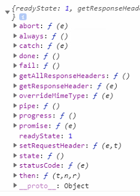

## Ajax Common Function 만들기  

## 2019.08 추가
- RESTFUL 기반으로 작업하기 위해 HTTP method인 GET/POST/PUT/DELETE로 작업을 하였다.  
- Ajax 변수에 Json 타입/FormData 타입 insert, select, update, delete  
  각각 type 별로 function을 object로 선언하여 다시 리팩토링 하였다.
```
const ajax = {
    createJsonData: function(url, data){
        return $.ajax({
            url: url,
            type: 'POST',
            data: data,
            dataType: 'json',
            async: false,
            success: function(data){

            }
        }).responseJSON;
    },
    createFormData: function(url, data){
        return $.ajax({
            url: url,
            type: 'POST',
            data: data,
            processData: false,
            contentType: false,
            async: false,
            success: function(data){

            }
        }).responseJSON;
    },
    readData: function(url, data){
        return $.ajax({
            url: url,
            type: 'GET',
            data: data,
            dataType: 'json',
            async: false,
            success: function(data){

            }
        }).responseJSON;
    },
    updateData: function(url, data){
        return $.ajax({
            url: url,
            type: 'PUT',
            data: data,
            dataType: 'json',
            async: false,
            success: function(data){

            }
        }).responseJSON;
    },
    deleteData: function(url, data){
        return $.ajax({
            url: url,
            type: 'DELETE',
            data: data,
            dataType: 'json',
            async: false,
            success: function(data){

            }
        }).responseJSON;
    }
};
```
  
  
## 아래는 수정한 흔적...
  
  
프로젝트를  하면서 ajax를 사용하는 부분이 많아 귀찮던 찰나에  
common function을 한번 만들어 봤다.  
ajax로 데이터를 리턴 받고 싶은데 아래와 같은 식으로 해보니 데이터가 콜백 받아오지 못하였다... undefind...   
하긴 쉽게 될리가 없다....ㄷㄷ  

### - 첫번째 시도
- undefined가 나옴....  
```
//첫번째 콜백 값 리턴... undefined....
let ajaxFunc = (url, type, dataType, data) => {
    $.ajax({
        url: url,
        type: type,
        dataType: dataType,
        data: data,
        success: function(data){
            //console.log(data);
            return data;
        }
    });
};
```
  

### - 두번째 시도
```
//두번째 ajax 함수 리턴... function 전체 값이 나옴... 그래도 뭐가 나옴...  
let ajaxFunc = (url, type, dataType, data) => {
    return $.ajax({
        url: url,
        type: type,
        dataType: dataType,
        data: data,
        success: function(data){
            //console.log(data);
        }
    });
};
```
#### - 두번째 시도 결과  
    - 내가 찾고자 하는 값은 안나왔다....  
    - 뭐가 문제일까.. 그래서 잠시 구글링을 해보았다. 뭔가 나와 같은 시도를 한 사람이 있어 참고해봤다!  
  
  
  
### - 세번째 시도
```
let ajaxFunc = (url, type, dataType, data) => {
    return $.ajax({
        url: url,
        type: type,
        dataType: dataType,
        data: data,
        async: false,    //속성값 기본 true, 동기시킬시 false로 줌
        success: function(data){
            //console.log(data);
        }
    });
};
```
#### - 세번째 시도 결과  
    - 동기 처리 방식으로 변경하니 값이 나왔다! 때에 따라 동기로 처리해야 된다더니... 여기서 사용된다.  
  
  
  
### - responseText 속성을 사용했더니 json 형태의 데이터가 문자열로 리턴되었다.  
- 기존 문자열에 ""로 감싸져서 리턴....   
```
//responseText 속성을 사용하니 값이 ""로 감싸져서 return 되었다. 
let ajaxFunc = (url, type, dataType, data) => {
    return $.ajax({
        url: url,
        type: type,
        dataType: dataType,
        data: data,
        async: false,
        success: function(data){
            //console.log(data);
        }
    }).responseText;
};
```
  

### - 그래서 다시 json 형태로 변환 하는 작업을 했다.
```
let ajaxFunc = (url, type, dataType, data) => {
    return JSON.parse($.ajax({
        url: url,
        type: type,
        dataType: dataType,
        data: data,
        async: false,
        success: function(data){
            //console.log(data);
        }
    }).responseText);
};
```
#### 그 결과  
- responseJSON 타입으로 응답  
  
  

### 이 코드를 기반으로 common function 작업
```
let ajaxFunc = (url, type, dataType, data) => {
    return $.ajax({
        url: url,
        type: type,
        dataType: dataType,
        data: data,
        async: false,
        success: function(data){
            //console.log(data);
        }
    }).responseJSON;
};
```
  
  


