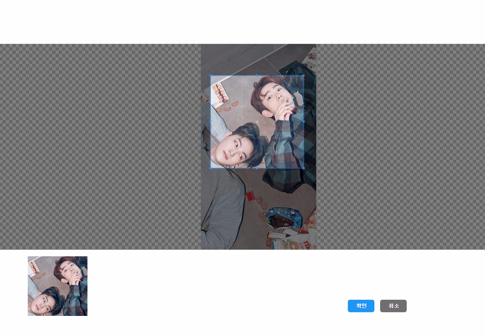

## image crop

프로젝트를 진행하면서 프로필 이미지를 업로드 할 일이 생겼다.  
업로드 전 cropper.js 를 이용해서 이미지를 crop 해보자!  


### - 우선 input file 태그와 crop된 이미지를 출력해줄 img 태그가 필요하다.
```
<body>
...
 
<input type="file" id="fileUpload" name="fileUpload"/>
...
</body>
```
  

### - cropper.js에서 제공하는 css와 js파일은 선언한다.
```
<head>
    <!--cropper-->
    <link rel="stylesheet" href="/css/web/crop/cropper.css">
    <link rel="stylesheet" href="/css/web/crop/main.css">
    <!--cropper-->
</head>
<body>
    ...
    <!--cropper-->
    <script type="text/javascript" src="/js/common/crop/cropper.js"></script>	<!-- crop.js -->
    <script type="text/javascript" src="/js/common/crop/main.js"></script>	<!-- main.js -->
    <!--cropper-->
</body>
```
  
  
### - cropper.js에서 제공하는 html 예제는 다양하다.  
    - 그 중 팝업을 띄워 crop하는 형태로 다듬어 사용했다.  
```
<div class="wrap" style="display: none;">
	<div class="img-container">
		
	</div>
		
	<div class="img-preview preview-lg"></div>
	<a class="btn btn-primary" id="download" href="javascript:void(0);" download="cropped.jpg" style="display: none;">Download</a>
	<div class="container" style="position: fixed; top:80%; right:25%;">
		<div class="row" id="actions">
			<div class="col-md-9 docs-buttons">
				<div class="btn-group">
					<div class="btn btn-primary" id="confirm" data-method="getCroppedCanvas">
						<span class="docs-tooltip" data-toggle="tooltip">확인</span>
					</div>
					<div class="btn btn-primary" id="cancel">
						<span class="docs-tooltip" data-toggle="tooltip">취소</span>
					</div>
				</div>
			</div><!-- /.docs-buttons -->
			<div class="col-md-3 docs-toggles"></div><!-- /.docs-toggles -->
		</div>
	</div>
</div>
```
#### - 세번째 시도 결과  
    - 동기 처리 방식으로 변경하니 값이 나왔다! 때에 따라 동기로 처리해야 된다더니... 여기서 사용된다.  
  
  
  
### - 그리고 추가로 main.js 부분도 살짝 수정을 했다.
```
case 'getCroppedCanvas':
    if (result) {
        // Bootstrap's Modal
        //$('#getCroppedCanvasModal').modal().find('.modal-body').html(result);

        if (!download.disabled) {
            download.download = uploadedImageName;
            download.href = result.toDataURL(uploadedImageType);

            /* 추가 */
            $('.wrap').css('display', 'none');    //팝업 안보이게
            $('#profileImg').attr('src', download.href);   //base64 형태의 이미지 출력
            /* 추가 */
        }
    }
    break;
```

#### - 위에서 crop한 부분을 아래에서 보여준다.
  

#### - img 태그에 출력된 이미지
  
  

### 참고 : [Cropper.js](https://fengyuanchen.github.io/cropperjs/)
