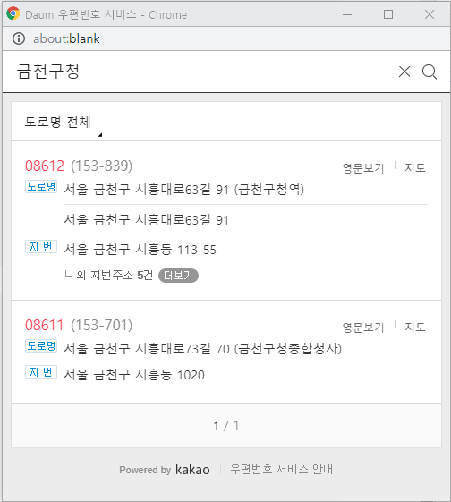
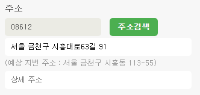
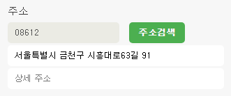

## Daum 주소 API와 Poesis 주소 API

## * Daum 주소 API
### 1. 주소 검색 관련 스크립트 Import
```
<script type="text/javascript" src="http://dmaps.daum.net/map_js_init/postcode.v2.js"></script>		<!-- Daum 주소 api -->
```
### 2. 주소 관련 출력될 폼 view 그려준다.
```
...생략
<input type="text" class="zip-no" id="zipNo" placeholder="우편번호" readonly="readonly" disabled="disabled"/>
<span class="search-addr" id="searchAddr">주소검색</span><br/>
<input type="text" class="addr road-addr" id="roadAddr" placeholder="도로명 주소" /><br/>
<div class="guide" id="guide" style="display:none;"></div>
<input type="text" class="detail-addr" id="detailAddr" placeholder="상세 주소" />
...생략
```

### 3. 주소 API 호출
- new daum.Postcode() 메서드를 통해서 주소 검색 API를 호출한다.  
```
<script type="text/javascript">
$(function(){
    $('.search-addr').on('click', function(){
        new daum.Postcode({
            oncomplete: function(data) {
                // 도로명 주소의 노출 규칙에 따라 주소를 표시한다.
                // 내려오는 변수가 값이 없는 경우엔 공백('')값을 가지므로, 이를 참고하여 분기 한다.
                const roadAddr = data.roadAddress; // 도로명 주소 변수

                //우편번호, 도로명주소, 예상 지번 주소 출력
                document.getElementById('zipNo').value = data.zonecode; //우편번호
                document.getElementById("roadAddr").value = roadAddr;   //도로명주소 input text 출력
                const guideTextBox = document.getElementById("guide");   
                guideTextBox.innerHTML = '(예상 지번 주소 : ' + data.jibunAddress + ')';    //지번주소 div 출력
                guideTextBox.style.display = 'block';
                //document.getElementById("numberAddr").value = data.jibunAddress;
                
                // 사용자가 '선택 안함'을 클릭한 경우, 예상 주소라는 표시를 해준다.
                if(data.autoRoadAddress) {  //지번 주소에 매핑된 도로명 주소가 여러개일 경우, 사용자가 지번주소 선택시 도로명 주소 자동 매핑
                    const expRoadAddr = data.autoRoadAddress;
                    console.log('도로명주소 자동 매칭:::'+expRoadAddr);
                    document.getElementById("roadAddr").value = expRoadAddr;                   
                }else if(data.autoJibunAddress) {  //도로명주소에 매핑된 지번주소가 여러개일 경우, 도로명주소 선택시 지번주소 자동 매핑
                    const expJibunAddr = data.autoJibunAddress;
                    console.log('지번주소 자동 매칭:::'+expJibunAddr);
                    guideTextBox.innerHTML = '(예상 지번 주소 : ' + expJibunAddr + ')';
                    guideTextBox.style.display = 'block';
                }
            }
        }).open();
    });
});
</script>
```

### Poesis 주소 API 적용한 결과
  
  

### 참고 : [Daum 주소 API](https://spi.maps.daum.net/postcode/guidessl#usage)
  
  

## * Poesis 주소 API
### 1. 주소 검색 관련 스크립트 Import
```
<script type="text/javascript" src="//d1p7wdleee1q2z.cloudfront.net/post/search.min.js"></script>	<!-- Poesis 주소 api -->
```
### 2. 주소 관련 출력될 폼 view 그려준다.
- input type="text" class 값을 통해서 해당 input 값이 출력된다.  
```
...생략
<input type="text" class="postcodify_postcode5 zip-no" id="zipNo" placeholder="우편번호" readonly="readonly" disabled="disabled"/> <!-- 우편번호 -->
<span class="search-addr" id="searchAddr">주소검색</span><br/> <!-- 주소검색 버튼 -->
<input type="text" class="postcodify_address addr" id="addr" placeholder="도로명 주소" /><br/> <!-- 주소 --> 
<input type="text" class="postcodify_details detail-addr" id="detailAddr" placeholder="상세 주소" /> <!-- 상세주소 -->
...생략
```

### 3. 주소 API 호출
- postcodifyPopUp() 메서드를 통해서 주소 검색 API를 호출한다.  
```
<script type="text/javascript">
$(function(){
    $('.search-addr').postcodifyPopUp();
});
</script>
```

### Poesis 주소 API 적용한 결과
  
  

### 참고 : [Poesis 주소 API](https://www.poesis.org/postcodify/guide/example)

